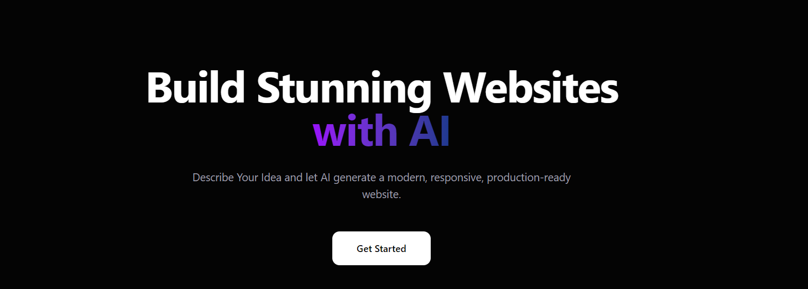

# GenWeb.ai - AI Website Builder

<p align="center">
  
</p>

<p align="center">
  <a href="https://gen-web-ai-1-6qrz.onrender.com" target="_blank">
    
  </a>
  <a href="https://github.com/reck98/gen-web-ai" target="_blank">
    
  </a>
  <a href="https://github.com/reck98/gen-web-ai/blob/main/LICENSE">
    
  </a>
  <br/>
  
  
  
  
  
  
  
  
</p>

---

**GenWeb.ai** is a full-stack AI-powered web application that generates production-ready, responsive HTML websites from natural language prompts. Describe your idea, and the AI builds a complete multi-page website with modern UI, animations, and mobile-first responsive design.

---

## Features

- **AI-Powered Generation** — Describe your website in plain English and get a complete, production-ready HTML/CSS/JS website
- **Iterative Refinement** — Improve your website through conversation-style prompts
- **Fully Responsive Output** — Every generated site is mobile-first and works on all screen sizes
- **Live Code Editor** — Monaco-based editor with real-time preview
- **One-Click Deploy** — Deploy generated websites to a shareable public URL
- **Credit-Based System** — Purchase credits via Stripe to generate and update websites
- **Google Authentication** — Sign in with Google via Firebase Auth
- **Modern UI** — Built with React 19, Tailwind CSS 4, and Framer Motion

---

## Tech Stack

### Frontend (`client/`)
- **React 19** with Vite 8
- **Tailwind CSS 4** for styling
- **Redux Toolkit** for state management
- **Firebase Auth** for Google authentication
- **Monaco Editor** for code editing
- **Framer Motion** for animations
- **Axios** for API calls
- **React Router DOM** for routing

### Backend (`server/`)
- **Express 5** REST API
- **MongoDB + Mongoose** for database
- **JWT** for authentication cookies
- **Stripe** for payment processing
- **OpenRouter API** for AI generation (DeepSeek Chat model)
- **Morgan** for logging

---

## Architecture

```
┌──────────────┐     ┌──────────────────┐     ┌───────────┐
│   React SPA   │────▶│  Express API     │────▶│  MongoDB  │
│  (Vite Build) │     │  (Server)        │     │           │
└──────────────┘     └──────────────────┘     └───────────┘
       │                      │
       │                      ├──▶ OpenRouter AI
       │                      ├──▶ Stripe Payments
       │                      └──▶ Firebase Auth
       │
  ┌────┴────┐
  │ Monaco  │
  │ Editor  │
  └─────────┘
```

---

## Getting Started

### Prerequisites
- Node.js 18+
- MongoDB instance (local or Atlas)
- Firebase project (for Google Auth)
- Stripe account
- OpenRouter API key

### 1. Clone & Install

```bash
git clone https://github.com/reck98/gen-web-ai.git
cd gen-web-ai

# Install server dependencies
cd server
npm install

# Install client dependencies
cd ../client
npm install
```

### 2. Environment Variables

**Server** (`server/.env`):
```env
MONGO_URI="your_mongo_connection_string"
PORT="3002"
JWT_SECRET="your_jwt_secret"
FRONTEND_URL="http://localhost:5173"
DB_NAME="gen-web-ai-db"
OPENROUTER_API_KEY="your_openrouter_api_key"
STRIPE_SECRET_KEY="your_stripe_secret_key"
STRIPE_WEBHOOK_SECRET="your_stripe_webhook_secret"
```

**Client** (`client/.env`):
```env
VITE_FIREBASE_API_KEY="your_firebase_api_key"
```

### 3. Run Development

```bash
# Terminal 1: Start server
cd server
npm run dev

# Terminal 2: Start client
cd client
npm run dev
```

The client runs on `http://localhost:5173` and the API on `http://localhost:3002`.

### 4. Build for Production

```bash
cd client
npm run build
```

The server automatically serves the built client from `client/dist/` when `NODE_ENV=production`.

---

## API Endpoints

| Method | Endpoint | Auth | Description |
|--------|----------|------|-------------|
| `POST` | `/api/auth/google` | No | Google OAuth login |
| `GET` | `/api/auth/logout` | No | Clear auth cookie |
| `GET` | `/api/user/me` | Yes | Get current user |
| `POST` | `/api/website/generate` | Yes | Generate a new website |
| `POST` | `/api/website/update/:id` | Yes | Update website via AI |
| `GET` | `/api/website/get-by-id/:id` | Yes | Get website by ID |
| `GET` | `/api/website/get-by-slug/:slug` | No | Get website by slug (public) |
| `GET` | `/api/website/get-all` | Yes | Get all user websites |
| `GET` | `/api/website/deploy/:id` | Yes | Deploy website to public URL |
| `POST` | `/api/billing` | Yes | Create Stripe checkout session |
| `POST` | `/api/stripe/webhook` | No | Stripe webhook for payments |

---

## Credit System

| Plan | Price | Credits |
|------|-------|---------|
| Free | ₹0 | 100 |
| Pro | ₹499 | 500 |
| Enterprise | ₹1499 | 1000 |

- **Generating** a new website costs **50 credits**
- **Updating** an existing website costs **25 credits**

---

## Screenshots

<p align="center">
  
  <br/>
  <em>Dashboard — manage your generated websites</em>
</p>

---

## Links

- **Live Site**: [https://gen-web-ai-1-6qrz.onrender.com](https://gen-web-ai-1-6qrz.onrender.com)
- **GitHub Repo**: [https://github.com/reck98/gen-web-ai](https://github.com/reck98/gen-web-ai)
- **Report Issues**: [GitHub Issues](https://github.com/reck98/gen-web-ai/issues)

---

## License

This project is licensed under the ISC License.
